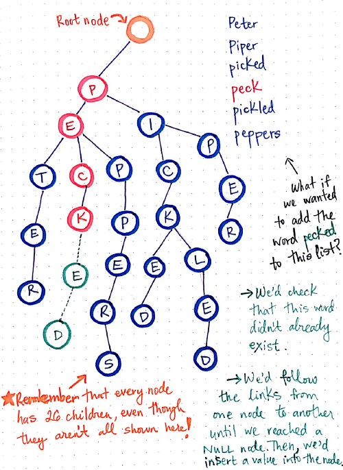

# Trie

>💡 On Notion → [Trie](https://www.notion.so/Trie-428346be3eba467780a0f220bbefccfd)
>
# **Introduction**

- **[Trie](http://en.wikipedia.org/wiki/Trie)** **is a special data structure used to store strings that can be visualized like a graph. A trie is also known as a digital tree and sometimes even radix tree or prefix tree.**
- If we store keys in a binary search tree, a well balanced BST will need time proportional to **M * log N**, where M is the maximum string length and N is the number of keys in the tree. **Using Trie, we can search the key in O(M) time**. However, the penalty is on Trie storage requirements.
- Tries are generally used on groups of strings, rather than a single string.

### Representation of Trie



### What is a Prefix?
> **Trie consists of nodes and edges. Each node represents a character and contains an array of english alphabet that connects the parent to the children.**
> 
> - In the above example, we can see that the root of the trie is null and then each string is processed by adding a character as a node to the tree and then branching out to add other characters. To know the end of each string, we need to maintain `isEndOfWord = false/true` with every character.
> - Now, a **prefix** of a string are the ‘n’ letters from the beginning of the string till the end. 
> Prefixes of the string ‘$**abacaba**$’ are: $a, ab, aba, abac, abaca, abacab$.
> - Trie is called a **Prefix Tree** because it stores strings based on common prefixes. The strings that begin with same character(s) are part of the same branch and begin with the same common node until they diverge.
> - From the figure, if we look at node ‘a’ and its branches, we will find that it consists of 4 strings, all of them beginning with the same common node ‘a’. The strings are : $‘ab’, ‘ad’, ‘aba’, ‘abc’.$
>     - Between $‘ab’$ and $‘ad’$, $‘aba’$  and $‘abc’$ , they all have a common prefix as $‘a’.$ Hence, all these charcaters will have a common node ‘a’.
>     - Between $‘aba’$ and $‘abc’$, they again have one more common prefix: $‘ab’$ and hence they will have 2 common nodes before they diverge, namely $‘a’$ and  $‘b’$.

<br/>

# **Design and Implementation**

### Operations on Trie

1. **insert() →** Every character of the input string is inserted in the tree as a new node. Every node also contains an array of children and `isEndOfWord` field. The array of children points to the next node in the tree that will store the next character of the string. 
2. **search() →** to search for a string in a trie we begin the node that contains the starting character and move down. If we have reached the end of the word, we have found the string. The search can also terminate midway, if a character mismatch occurs.  
3. **delete()** → to delete a string from trie, we first need to determine if the prefix of the string is not a part of any other strings. Then, we start deleting from the node that is not part of any other string till the leaf node. 

<br/>

## Implementation

**A simple trie data structure can be implemented as:** 

> A trie data structure will consists of Trie Nodes that have:
> 
> 
> → an array of children : `Trie[] children = new Trie[26]` *(For simplicity, we have taken the trie size to be 26).*
> 
> → boolean field to mark the end of the word : `boolean isEndOfWord`

>💡 In case of duplicate values in the trie, make `isEndOfWord` an integer.
> This will indicate the number of duplicate strings. So, if `isEndOfWord = 3`, we know that there are 3 strings with same values. So, if we delete one of them, `isEndOfWord` becomes 2, meaning we still have 2 more strings with the same values.
> 

<br/>

```java
public class Trie {
    const ALPHABET_SIZE = 26;
    TrieNode root;

    class TrieNode {
        Trie[] children;
        boolean isEndOfWord;

        TrieNode() {
            isEndOfWord = false;
            for (int i = 0; i < ALPHABET_SIZE; i++)
                children[i] = null;
        }
    }

    Trie() {
        root = new TrieNode();
    }

    public void insert(String word) {...}
    public boolean search(String word) {...}
    public boolean hasChildren(TrieNode current) {...}
    public TreiNode delete(String word) {...}
}
```

>💡 **Space Complexity: O(ALPHABET_SIZE * M * N)**
>
> where, 
> 
> ALPHABET_SIZE → each node will have an array of children of alphabet_size
> 
> N → length of the array of strings
> 
> M → maximum length of the string
> 
> ⇒ However, another respresentation of trie in the form of **compressed trie, [ternary search tree](http://en.wikipedia.org/wiki/Ternary_search_tree)** , etc. can be used to minimise the memory requirements.

<br/>
<br/>

### 1. **Insertion → O(m), where ‘m’ is the length of the string to be inserted**

> **Every character in the string, if not already present in the trie, will be inserted as a new node.**
> 
> - Before inserting the new node, we need to check if the current character has been referenced already, i.e. if it is a prefix to another string. We can check that through the children array and see if that particular character in the children array is already a TrieNode.
>     - If it has been referenced, we do not need to do anything and move forward to insert the next character.
>     - If it’s not, then we need to create a new TrieNode for that character.
> - After we have traversed the whole string, the last character should signify the end of the string by enabling 
> `isEndOfWord = true;`

```java
public void insert(String word) {
    TrieNode current = root;

    for (char ch: word.toCharArray()) {
        if (current.children[ch - 'a'] == null)
            current.children[ch - 'a'] = new TrieNode();
        current = current.children[ch - 'a'];
    }

    current.isEndOfWord = true;
}
```
<br/>

### 2. Search **→ O(m), where ‘m’ is the length of the string to be searched**

> Searching the string is pretty similar to insertion.
> 
> - We need to compare each character of the string with the node of the `children[]` as we move to the bottom of the tree. There can be 3 caases:
>     1. If the characters of the string and the node of the `children[]` match, then we traverse to the next node referenced in the `children[]`.
>     2. But if the characters do not match, then end the search by returning false
>     3. We have exhausted the characters in the string and the last character of the string should be the end of the word in the node of the `children[]`; return `isEndOfWord`;

```java
public boolean search(String word) {
    TrieNode current = root;

    for (char ch: word.toCharArray()) {
        if (current.children[ch - 'a'] == null)
            return false;
        currrent = current.children[ch - 'a'];
    }

    return current != null && isEndOfWord;
}
```
<br/>

### 3. Delete **→ O(m), where ‘m’ is the length of the string to be deleted**

When deleting a string, we will encounter one of the 3  conditions:

1. **String does not exist in the trie**
If node of any of the characters in the trie is null, then the string does not exist.
2. **String is not a prefix to or a part of any other string** 
The string to be deleted is unique in trie and no characters of the string are a part of any other string. Here, we delete all the nodes.
3. **String is a prefix to a larger string or string is part of a smaller string**
    1. Here, if the string is prefix to larger string, then we only need to unmark `isEndOfWord`. 
    2. But if a smaller string is a part of this string, then we need to delete only the nodes that are not part of the smaller string.

> The delete operation can be performed recursively using the **bottom-up** approach. The delete method will accept 3 params:
`TrieNode delete(TrieNode current, int index, String word)`
Where, 
**current** → will begin from root and traverse to the bottom of the trie
**index →** will be a pointer to the string
**word** → will be the string to be deleted.
> 
> - We will traverse the tree, and check if any of the characters of the string are null in trie. If they are return null. `if(current == null) return null;`
> - But, if all the characters of the string appear in the trie, we will reach the end of the string when `index == string.length()`. We cannot use `isEndOfWord` as a pointer to the end of the string because there may be other characters in the string that may be part of another string and will have `isEndOfWord` to be true.
>     
> - When we have reached the end of the string, we need to check if is a prefix or is unique.
>     - So if `isEndOfWord == false`, meaning no such string exists, return the `current` node. But if it is `true`, then set the `current.isEndOfWord` to `false`.
>     - Now, check if the node has any children. If the current string is not a prefix to another larger string, it will not have any children and thus we can set the node to `null`.
> - Now, if another smaller string is a part of this string, then we need to delete the nodes that appear after the smaller string.
>     - Since we are using a bottom up approach and this is a recursive function, we can backtrack when we have reached the end of the string or a character is not found in the trie.
>     - Once we backtrack, we can start deleting the extra nodes that are not part of any string. We can only delete the nodes that have no children and are not the end of the word for any other string. If both these conditions are satisfied, we can delete the node.

```java
TrieNode remove(TrieNode current, String word, int index){
    if (current == null)
        return null;

    //reached the end of the string
    if (index == word.length()) {
        //unmark the isEndOfWord if we have reached the last character
        if (current.isEndOfWord)
            current.isEndOfWord = false;

        //check if it is a prefix to any other string, ie. if it has any children
        if (!hasChildren(current))
            current = null;

        return current;
    }

    char ch = word.charAt(index);
    current.children[ch - 'a'] = remove(current.children[ch - 'a'], word, index + 1);

    /* BACKTRACKING:
    	The remove function will return null when:
    	1. A character is not found in the trie**
    	2. We have reached the last character of the string and it has no children.
    	Now at this point, if both the above conditions are satisfied, the child
    	of the current node will be null. So, if the current node does not have any
			children and is not the end of any other word in the trie, then we make the 
			current node null. Else it will return the current node as it is.
    	The process will backtrack till the root node of the trie.
    */

    if (!hasChildren(current) && !current.isEndOfWord)
        current = null;

    return current;
}
```

```java
boolean hasChildren(TrieNode current) {
    for (int i = 0; i < ALPHABET_SIZE; i++)
        if (current.children[i] != null)
            return true;

    return false;
}
```
<br/>

### 4. Display **→ O(m*26)**

To display the chracters, it will begin from the root and will print if it has any children. The `display()` will accept 3 parameters: 
Where, 

1. **TrieNode current →** will begin from root and traverse to the bottom of the trie
2. **StringBuilder str →** Notice that the string is of stringbuilder type. It is so because the string will undergo modifications in between. Also, at first we will pass this as an empty string and it will be used to display the words in the trie one by one.
3. **int level** → It will be used to modify the characters at the same level. We will understand this more once we see the implementation.

<br/>

To display the string in the trie, we will have to look at its structure:


> We begin from the root to the bottom of the tree.
> 
> - For every node, loop through its children and see if it is not null. For every children that is not null, do this:
>     - add the char value to the string
>     - Move the current pointer to the next level of that branch and increase the value of the level.
> - When, for a branch, we reach the end of the word, we print the string. We then explore for any other children the current node might have.
> 
> 💡 **For example:**
> 
> - When we traverse the above trie, we start from root, start exploring its array of children.
> - $‘a’$ being the first character we process that node. We add that character to the string and explore its children.
> - So, the current pointer moves from $root$ → $‘a’$ → $'b'$ and level moves from 0 → 1 → 2. So, when we reach $‘b’$, we see that the current node is the end of the word, so we print the string ‘$ab’$ and then start exploring the children of $‘b’$ node.
> - We then move to node $‘a’$  and $level = 3$ and the string becomes $‘aba’$. Since this node is also the end of the word, we print $‘aba’$.
> - We start to explore children of $‘a’$, but since it doesn’t have any, we backtrack and return to $level = 2$ and now current node will point to $‘b’$ but string still is $‘aba’$.
> - Because when we backtrack, we return to the point right after the `display()`. Here, we can see that before calling the `display()`, we had already added $‘a’$ to the string. So when we return, we exit the if statement but are still in the for loop. We then explore other children of node $‘b’$ that are at the $level = 3$ .
> - So, if the last character of the string is not deleted before exploring other children of node $‘b’$, then the string will look like this: $‘abac’$. To avoid this, just keep on replacing the characters of the string at the same level.
> - Imagine a slot for each level in the string. As we explore, we fill the slots with the characters, but at any level, we can fill the slot with one character only. So, if we keep on adding the characters at the same level, the slot representing that will keep on updating to the last added character.
> 
>


```java
static void display(TrieNode current, StringBuilder str, int level) {
    if (current.isEndOfWord)
        System.out.println(str);

    for (int i = 0; i < ALPHABET_SIZE; i++) {
        if (current.children[i] != null) {
            char ch = (char)(i + 'a');
            str.replace(level, str.length(), Character.toString(ch));
            display(current.children[i], str, level + 1);
        }
    }
}
```
